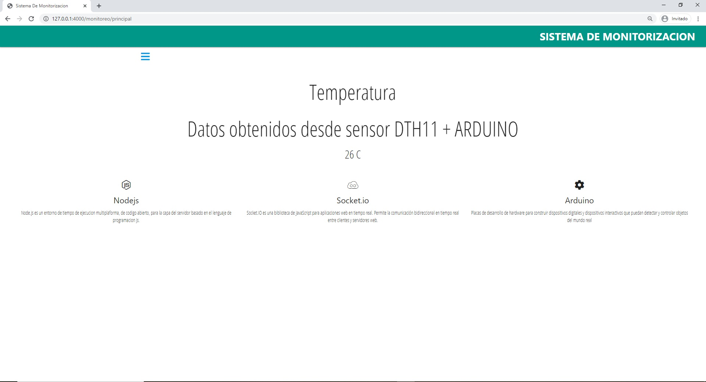
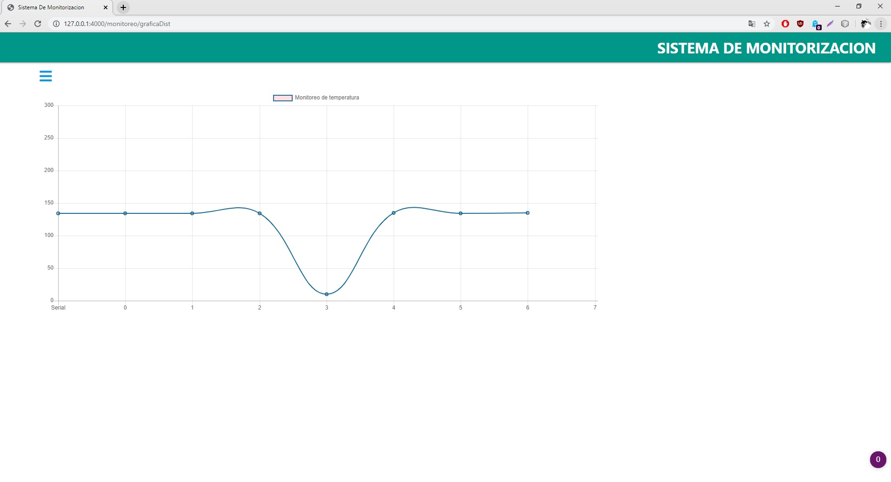

# SistemaDeMonitorizacion

Monitorización de temperatura, humedad y distancia por medio de placa Arduino y utilización de Socket.io para obtener los datos en tiempo real
//
Temperature, humidity and distance monitoring via Arduino board and use of Socket.io to obtain data in real time

Datos // Data:

Gráfica // Chart:
  
  
